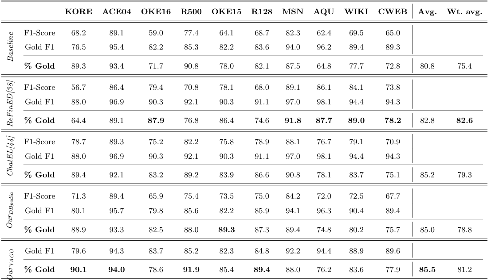

# KNOWLEDGE GRAPHS FOR ENHANCING LARGE LANGUAGE MODELS IN ENTITY DISAMBIGUATION

This repository contains the data and the code to reproduce the experiments for the paper titled 'Knowledge Graphs for Enhanncing Large Language Models in Entity Disambiguation'. In order to obtain the results, the next steps should be followed:
1. **Create the subgraphs**: The method relies on using a KG to leverage a class taxonomy. In our case, we leverage YAGO and DBpedia. This subgraphs can be reused in different experiments (e.g., baseline, other LLMs, different prompts...) so by default they are stored so that they can be reused in different experiments. In order to create them, the scripts *create_{ontology}_graphs.py* can be executed. Note that to allow them to be easily run by everybody (e.g., the full KG weight ~200 GB and would require to be loaded in a approrpiate database to be able to be queried), in this repo they are accessed with SPARQL endpoints via API. This could affect the execution time, which will depend on the communication with the API. In order to avoid so, one could download a dump of these KGs and query them locally. Additionally, given the difference in size of the taxonomies (i.e., tens of thousands in YAGO and hundreds in DBpedia), the sbugraphs are build differently in the two scripts. In DBpedia, the full taxonomy is provided in $/data/dbo.pkl$, and the candidate entities are directly linked to it. In YAGO, the subgraph is built in a bottom-up approach. Again, the YAGO subgraphs can be generated as in DBpedia if one downloads the full YAGO taxonomy.
 * Input: datasets jsonl files (/data/)
 * Output: subgraph pickle files (/subgraphs_{ontology}/)
 * Scripts: *create_{ontology}_graphs.py*
2. **Entity disambiguation**: The scripts *pipeline_db.py* and *pipeline_yago.py* will generat the answer for the enitity disambiguation task. They rely on the usage of an LLM. The provided implementation is compatible with OpenAI API, Mistral API and LLMStudio (which allows to self-host LLM). Therefore, to get the results one must own an API key.  Again, the communication with the LLM and the speed in which an answer is returned may very depending on the model used and other factors such as the day or the time. Also, the models provided by OpenAI or Mistral may change or be updated.
 * Input: datasets jsonl files (/data/), subgraph pickle files (/subgraphs_{ontology}/)
 * Output: ED results in csv file (/results/{ontology})
 * Scripts: *pipeline_db.py* and *pipeline_yago.py*

Therefore, to generate the results for a given ontology the two scripts must be run. For instance, in the case of YAGO, the order would be: 
```
python3 create_yago_graphs.py
python3 pipeline_yago.py
```


3. **Evaluate results**: The script *evaluation.py* will generate the F1-score, the Gold-F1 and the % of Gold-F1 score, all inKB.



